# Expectaions

- General improvement in my front end skills, bootstraps available classes seems to be a gap in my knowledge
- JavaScript in general.


- Learn more about pros/cons with React vs. Angular/Vue/other. Learn more about React in general.
- Just general things surrounding React to get tips and pointers from the more experienced staff. I would also like to hear more about what other frameworks
  might potentially be used for future projects.


- React
- Good/clean code practice, functional code, SEO, reducing, context, hooks
- more about hooks

---

## CSS

---

### CSS Frameworks (https://github.com/troxler/awesome-css-frameworks)

- Bootstrap   (https://getbootstrap.com/)
- Foundation (https://get.foundation/)
- TailWind  (https://tailwindcss.com/)
- Semantic UI  (https://semantic-ui.com/)
- Bulma   (https://bulma.io/)
- Water.css (https://watercss.kognise.dev/)

---

#### Bootstrap

Bootstrap makes only sense, when we're working with the sources. (https://github.com/twbs/bootstrap/blob/main/scss/_variables.scss)

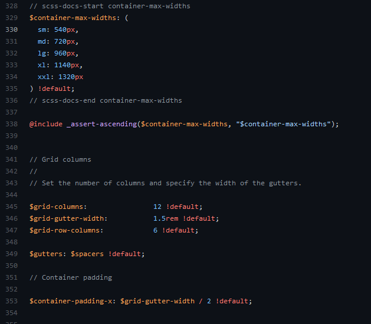

---

#### Tailwind

Known as very useful when working with components.

---

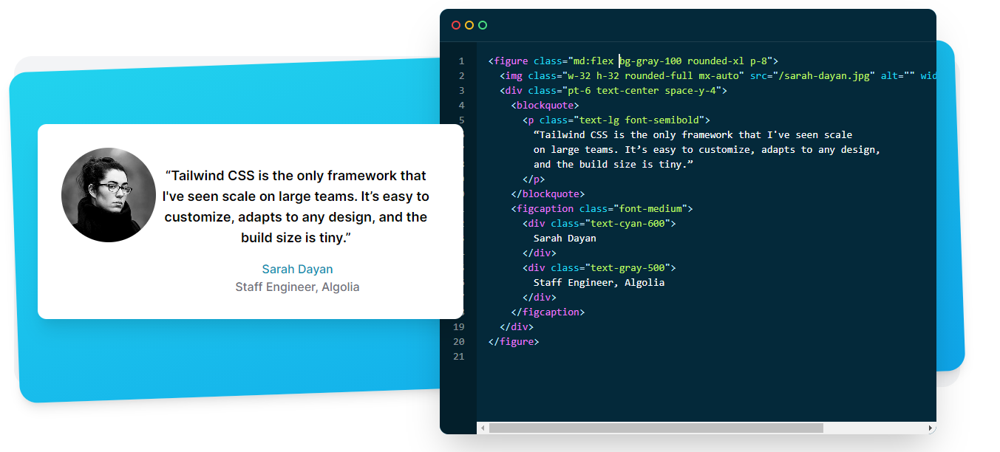

---

As you can see, the biggest issue is that the **VIEW** layer is mixed with the **PRESENTATION** layer.   
This mean, that if we want to change the appearance (styles,colors etc) we have to change the view. What if we want to change the main (brand) color in our
design? We have to change the whole application views!

---


---

#### Water.css

No class CSS - mean no conflicts and nothing to learn. Just use pure HTML and water will do the rest!
Excellent idea for bootstrapping projects/docs.

---
```css

button {
  transition:
    background-color 0.1s linear,
    border-color 0.1s linear,
    color 0.1s linear,
    box-shadow 0.1s linear,
    transform 0.1s ease;
  transition:
    background-color var(--animation-duration) linear,
    border-color var(--animation-duration) linear,
    color var(--animation-duration) linear,
    box-shadow var(--animation-duration) linear,
    transform var(--animation-duration) ease;
}

@media (prefers-color-scheme: dark) {

  button {
  transition:
    background-color 0.1s linear,
    border-color 0.1s linear,
    color 0.1s linear,
    box-shadow 0.1s linear,
    transform 0.1s ease;
  transition:
    background-color var(--animation-duration) linear,
    border-color var(--animation-duration) linear,
    color var(--animation-duration) linear,
    box-shadow var(--animation-duration) linear,
    transform var(--animation-duration) ease;
  }
}
```

---

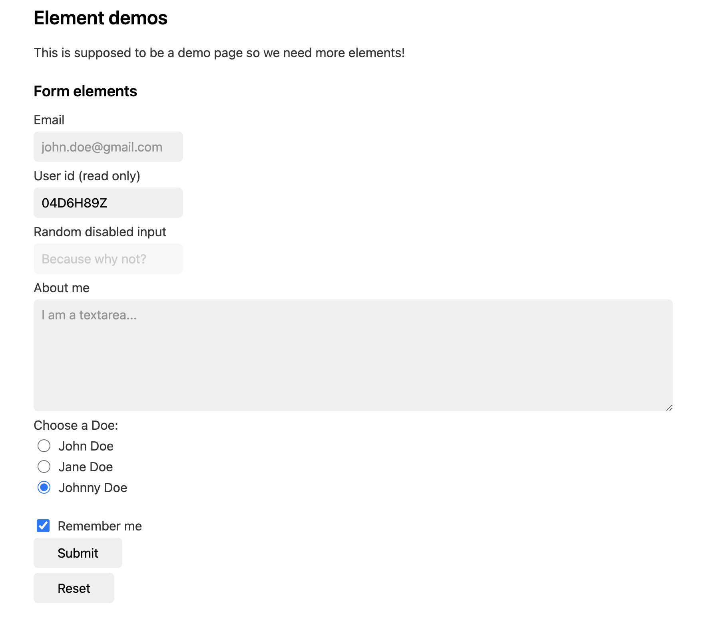

---

### Naming conventions

Read more (https://dev.to/ziizium/css-naming-conventions-5gd6)


- SMACSS ( Scalable and Modular Architecture for CSS )
- OOCSS ( Object-oriented CSS )
- Storytelling CSS Class Names
- BEM ( Block Element Modifier )

---
#### SMACSS (Scalable and Modular Architecture for CSS )


At the very core of SMACSS is categorization. By categorizing CSS rules, we begin to see patterns and can define better practices around each of these patterns.

There are five types of categories:

- Base
- Layout
- Module
- State
- Theme

---

#### OOCSS ( Object-oriented CSS )

---

#####separate structure and style
 
```css
.btn {
  display: inline-block;
  text-align: center;
  border-radius: 3px;
  font-family: Arial, Helvetica, sans-serif;
  font-size: 14px;
  color: #000;
  padding: 5px 10px;
}

.btn-primary {
  background: #47c4ff;
}

.btn-cancel: {
  background: #b5b5b5;
  color: #fff;
}
```
```html
<button class="btn btn-primary">Submit</button>
<button class="btn btn-cancel">Cancel</button>
```

#####separate container and content

```css
.meta h1 {
  font-size: 1em;
}

.post h1 {
  font-size: 1.2em;
}
```

VS 

```css
h1 {
  font-size: 1em;
}

h1.post-header {
  font-size: 1.2em;
}
```
---

See Bootstrap source code:   https://github.com/twbs/bootstrap/blob/main/scss/_buttons.scss

---
#### Storytelling CSS Class Names

Sometimes I run into situations where I need additional CSS class names to manipulate the styles. When that happens, I categorize those situations into typical types and I give every type of them a prefix class-name, which represents that type.

---
```html
<div class="common-message           "> <!-- Gray  Message --></div>
<div class="common-message is-approved"><!-- Green Message --></div>
<div class="common-message is-error  "> <!-- Red   Message --></div>
<div class="common-message is-alert  "> <!--Yellow Message --></div>
```

```scss

.common-message{ 
    /*component styles*/ 
    &.is-approved { color:green; }    
    &.is-error    { color:red; }    
    &.is-alert    { color:yellow; }    
}

```

---
#### BEM ( Block Element Modifier )

http://getbem.com/
---

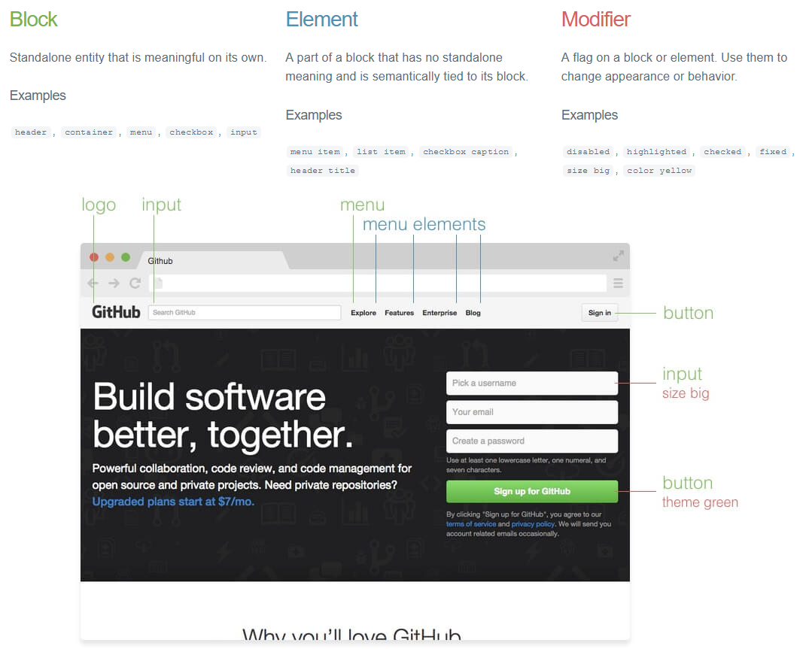

---

In CSS

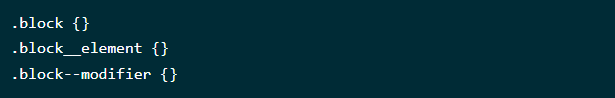

HTML vs CSS

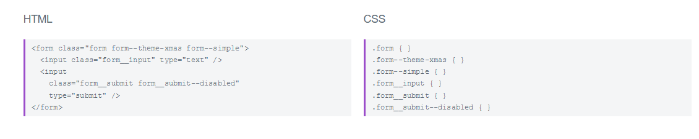

---
You don't need to write such long CSS classes by hand. Use SASS mixins for that (https://gist.github.com/Bigismall/8472451f82d77dd380447bea555be163)

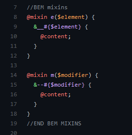

Do not apply HTML structures into BEM structure!

---

### SCSS

Please use SCSS

- https://www.sassmeister.com/
- IDE (scss file watchers)
- http://koala-app.com/

---

### CSS custom properties (a.k.a variables)

See presentation: (https://docs.google.com/presentation/d/1XffJxDlG5XSxT8MnXfQKUuf0xQ-MAxF9Bclvy6Fa3R8/edit?usp=sharing)

---


---

### New features in CSS ?

- css variables
- css scroll-behavior
- css scroll-snap
- css grid / css subgrid
- css grid masonry layout
- css Flexbox gaps
- css display: contents
- css object-fit: cover;
- css paint api
- css `content-visibility` https://developer.mozilla.org/en-US/docs/Web/CSS/content-visibility
- css `aspect-ratio` https://developer.mozilla.org/en-US/docs/Web/CSS/aspect-ratio

---

## JavaScript

---
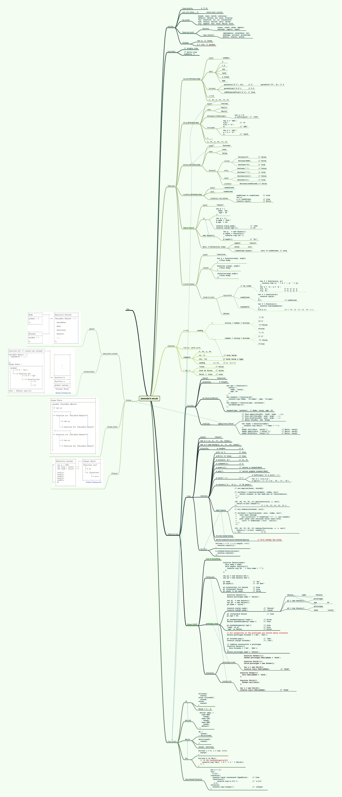

---

### Books

[Github Repository](https://github.com/chocopuff2020/javascript-ebooks-1)

---

[Good parts](https://github.com/chocopuff2020/javascript-ebooks-1/blob/master/%5BJavaScript%20The%20Good%20Parts%201st%20Edition%20by%20Douglas%20Crockford%20-%202008%5D.pdf)


---


---

[JavaScript Patterns](http://sd.blackball.lv/library/JavaScript_Patterns_%282010%29.pdf)

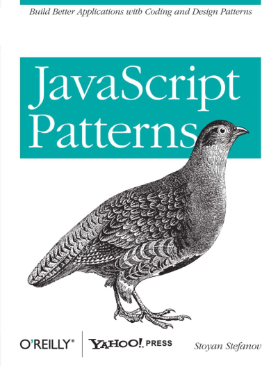

----


---

### My Book

JavaScript basics: (https://github.com/Bigismall/js-basic)

---

#### Timeout zero


We know that we can simulate asynchronicity, we would like to do it immediately, ignoring any delay. So we set 0ms, and we hope the passed function will run "immediately". 

However, even setting it to 0ms does not change the way JavaScript works. 

It is not that JS will abandon all other tasks and take care of the one. 

Queuing rules apply. It will also not start our task in a separate thread, because it cannot.

---

#### Timeout zero - example

```js
(function () {
  console.log("START");

  setTimeout(function callBackOne() {
    console.log("CALLBACK 1");
  });

  console.log("MESSAGE");

  setTimeout(function callBackTwo() {
    console.log("CALLBACK 2");
  },0);

  console.log("END");
})();

```

[https://codepen.io/Bigismall/pen/LLZGax](https://codepen.io/Bigismall/pen/LLZGax)

---

#### Timeout zero - result

```text
 START
 MESSAGE
 END
 CALLBACK 1
 CALLBACK 2
```

As you can see  `callBackOne()`  and `callBackTwo()`  were called with `0ms` param (or without any parameter), and their execution was moved to the end of the
queue.

So  `setTimeOut(function,0)`  says - *execute this function as soon as it is possible*.


---

### JavaScript gotchas!

---

#### Automatic type conversion

```js
console.log([1, 5, 20, 10].sort()) //[ 1, 10, 20, 5 ]
```

[https://codepen.io/Bigismall/pen/gRMPye](https://codepen.io/Bigismall/pen/gRMPye)

---

#### Are the numbers equal?

```js
var a = 0.1,
    b = 0.2,
    c = 0.3;

console.log((a + b) === c);    //false
```

```js
var a = 0 * 1,
    b = 0 * -1;

console.log(a, b);      //0 -0
console.log(a === b);   //true
console.log(1 / a === 1 / b);   //false
```

[https://codepen.io/Bigismall/pen/XgKXwb](https://codepen.io/Bigismall/pen/XgKXwb)

---

#### To string evaluation

```js
var a = 1,
    b = "2",
    c = a + b,
    d = b + a,
    e = (b + b) * 1,
    f = a + a;

console.log(c, typeof c);   // 12 string
console.log(d, typeof d);   // 21 string
console.log(e, typeof e);   // 22 number
console.log(f, typeof f);   // 2 number
```

[https://codepen.io/Bigismall/pen/OgXMYE](https://codepen.io/Bigismall/pen/OgXMYE)

---

#### Type of  trap

```js
typeof {} === "object" //true
typeof "" === "string" //true
typeof [] === "array"; //false
```

[https://codepen.io/Bigismall/pen/gRMPNz](https://codepen.io/Bigismall/pen/gRMPNz)

---

#### Math min and max values

```js
console.log(Math.max()); // -Infinity
console.log(Math.min()); // Infinity
```

[https://codepen.io/Bigismall/pen/dRXGxR](https://codepen.io/Bigismall/pen/dRXGxR)

---

---

#### TimeOut Sort

```js
var numbers = [38, 43, 33, 43, 27, 20, 33, 17, 49, 11, 30, 27, 35, 42, 14, 32, 44, 44, 16, 44];

numbers.forEach(function (number) {
  (function (number) {
    setTimeout(function () {
      console.log(number)
    }, number);
  }(number));
});
```

[https://codepen.io/Bigismall/pen/QgEyoY](https://codepen.io/Bigismall/pen/QgEyoY)

---

```text
11
14
16
17
20
27
27
30
32
33
33
35
38
42
43
43
44
44
44
49
```

---

### JS Interview questions

- https://dev.to/macmacky/70-javascript-interview-questions-5gfi
- https://skilled.dev/course/javascript-interview-questions

---

### JS killer question

Define the `even` method. Called on given array it should return just *even* numbers

```js
[1, 2, 3, 4, 5, 6, 7, 8, 9].even()  // 2,4,6,8
```

---

```js

if (!Array.prototype.even) {
  // won't work because of arrow function
  //Array.prototype.even = () => this.filter((e) => e % 2==0);
  Array.prototype.even = function () {
    return this.filter((e) => e % 2 == 0);
  };
}

console.log([1, 2, 3, 4, 5, 6, 7, 8, 9, 0].even());
```

---

### Awesome JavaScript

https://developer.mozilla.org/en-US/docs/Web/API

---


---

#### Speach API

- https://developer.mozilla.org/en-US/docs/Web/API/Web_Speech_API
- https://developer.mozilla.org/en-US/docs/Web/API/SpeechSynthesisUtterance
- https://gist.github.com/Bigismall/c6ab430bc09cff18f5bf28bf83fa9996
- https://codepen.io/Bigismall/pen/rNjOVyr

---

```js

document.querySelector("#magic").addEventListener("click", () => {
  const paragraphs = [...document.querySelectorAll("#article p")];
  const text = paragraphs.map((paragraph) => paragraph.innerText);
  const speechUtterance = new SpeechSynthesisUtterance();
  speechUtterance.lang = "pl";
  speechSynthesis.cancel();

  function speak (paragraphs) {
    const paragraph = paragraphs.shift();
    if (paragraph) {
      speechUtterance.text = paragraph;
      speechSynthesis.speak(speechUtterance);
      speechUtterance.onend = () => speak(paragraphs);
    } else {
      speechUtterance.onend = null;
    }
  }

  speak(text);
});

```

---

#### Shape (Text/BarCode/Face) Detection API

- https://wicg.github.io/shape-detection-api/
- https://developer.mozilla.org/en-US/docs/Web/API/Barcode_Detection_API

- https://bigismall.github.io/face-detection/
- https://github.com/Bigismall/face-detection

---

#### Observers

- https://developer.mozilla.org/en-US/docs/Web/API/Resize_Observer_API
- https://developer.mozilla.org/en-US/docs/Web/API/Intersection_Observer_API
- https://developer.mozilla.org/en-US/docs/Web/API/MutationObserver

---

#### EcmaScript modules

- https://developer.mozilla.org/en-US/docs/Web/JavaScript/Guide/Modules

---

```html

<script type="module">
  import detectFace from "./js/detect.mjs";
  import drawFace from "./js/canvas.mjs";
  import drawSticker from "./js/stickers.mjs";
  import initControls, {
    getCurrentSticker,
    displayLandmarks
  } from "./js/controls.mjs";

</script>
```

---

```js
const options = {
  fastMode        : true,
  maxDetectedFaces: 10,
};

async function detectFace (image) {
  const bitmap = await createImageBitmap(image);
  const detector = new window.FaceDetector(options);
  const detection = await detector.detect(bitmap);
  return {bitmap, detection};
}

export default detectFace;
```

---

#### JavaScript and frontend features ...

Do you want to be up to date? https://frontendfront.com/


---

## TypeScript

---

Docs

- https://www.typescriptlang.org/docs/

Playground

- [https://www.typescriptlang.org/play](https://www.typescriptlang.org/play?target=1&jsx=0#code/MYGwhgzhAEC2CWAXRYB2AjArgE2gbwFgAoaaAB03RHmGlTFgFMAuaCRAJ3lQHNjTgAe1TsOmYIkEcAFAEp8-UtEQALeBAB09JtAC80AEQBZAIIHFAX2LEVjECEFyFJaB0aJMHVNAAGACTsHaAASPFV1LQZGCx9iKyI46wSiIRFEODA9OkYAdzgkFAwcOWJUiEEQRg0HHmlYMA1be0dZWWIgA)

---

```ts

import React from 'react'

type ToggleType = readonly [boolean, () => void, () => void, () => void]

/**
 * @method useBoolean
 *
 * @param initialValue - default set to false
 * @returns [value, setTrue, setFalse, toggle] methods
 *
 */
export const useBoolean = (initialValue: boolean | undefined = false): ToggleType => {
  const [value, setValue] = React.useState<boolean>(initialValue === true)
  const setTrue = React.useCallback(() => setValue(true), [])
  const setFalse = React.useCallback(() => setValue(false), [])
  const toggle = React.useCallback(() => setValue((value) => !value), [])
  return [value, setTrue, setFalse, toggle]
}

```

---

## JavaScript Future

---

The Third Age of JavaScript: https://www.swyx.io/js-third-age/

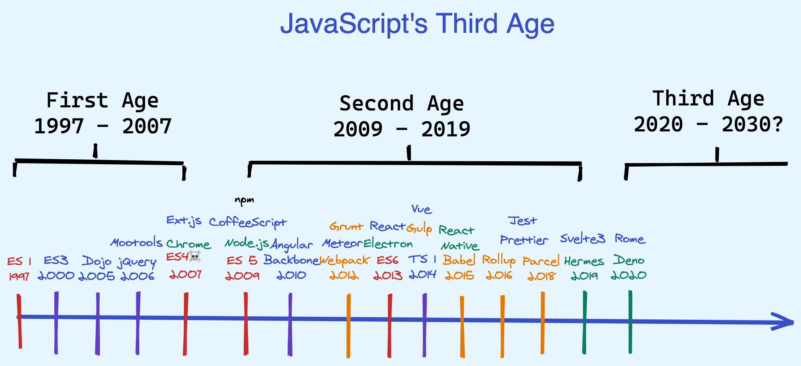

---

In summary: Third Age JS tools will be:

- Faster
- ESM first
- Collapsed Layers (One thing doing many things well instead of many things doing one thing well)
- Typesafe-er (built with a strongly typed language at core, and supporting TS in user code with zero config)
- Secure-er (from dependency attacks, or lax permissions)
- Polyglot
- Neo-Isomorphic (recognizing that much, if not most, JS should run first at buildtime or on server-side before ever reaching the client)

The result of all of this work is both a better developer experience (faster builds, industry standard tooling) and user experience (smaller bundles, faster
feature delivery). It is the final metamorphosis of JavaScript from site scripting toy language to full application platform.

---
Interesting projects to track

- ESBuild
  https://esbuild.github.io/

- Parcel
  https://parceljs.org/

- Rome  ( one tool for everything )
  https://rome.tools/

- WMR
  https://github.com/preactjs/wmr

- Estrella
  https://github.com/rsms/estrella

---

## React / Vue / Angular / Svelte

---

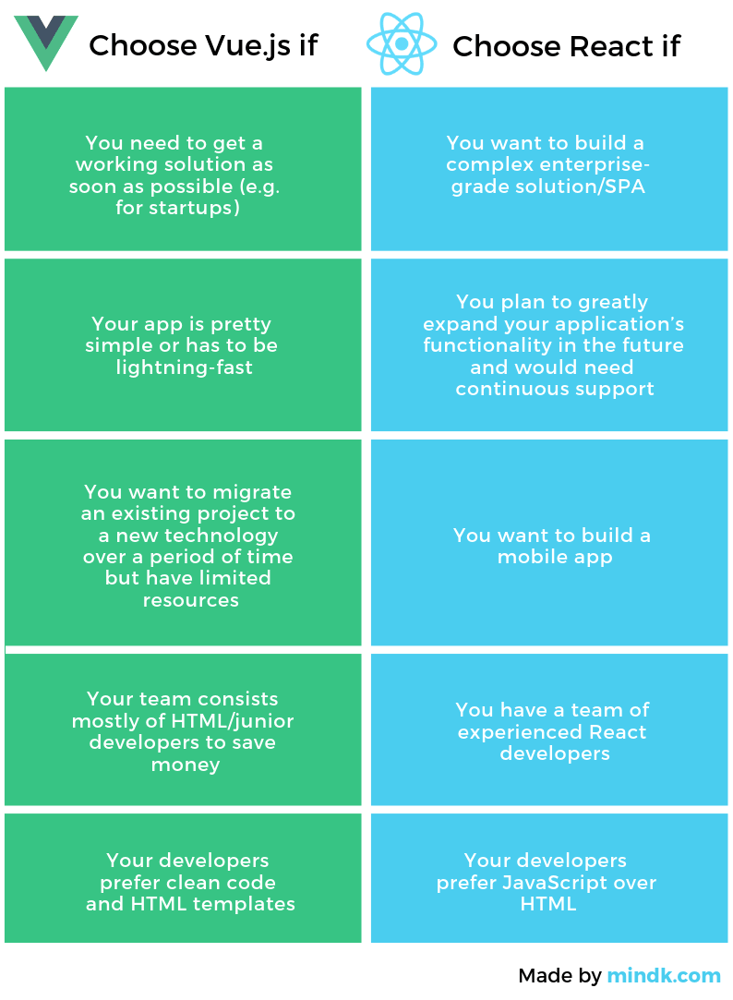

------

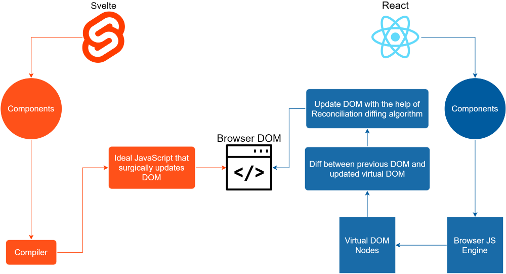

---

### React / Vue - list rendering

```js
function NumberList (props) {
  const numbers = props.numbers;
  const listItems = numbers.map((number) => <li>{number}</li>);

  return (
    <ul>{listItems}</ul>
  );
}
```

```html

<ul id="example-1">
  <li v-for="item in items"
      :key="item.message">
    {{ item.message }}
  </li>
</ul>
```

--- 

### React / Vue - conditional rendering

```js
function Greeting (props) {
  const isLoggedIn = props.isLoggedIn;
  if (isLoggedIn) {
    return <UserGreeting/>;
  }
  return <GuestGreeting/>;
}
```

```html
<h1 v-if="awesome">Vue is awesome!</h1>
```

---

```jsx
<>
  <h1>Cześć!</h1>{unreadMessages.length > 0 && <h2> Masz {unreadMessages.length} nieprzeczytanych wiadomości. </h2>}
</>

```

```html

<template v-if="ok">
  <h1>Title</h1>
  <p>Paragraph 1</p>
  <p>Paragraph 2</p>
</template>
```

---

### Angular

```html
<h2>My Heroes</h2>
<ul class="heroes">
  <li *ngFor="let hero of heroes"
      [class.selected]="hero === selectedHero"
      (click)="onSelect(hero)">
    <span class="badge">{{hero.id}}</span> {{hero.name}}
  </li>
</ul>

<div *ngIf="selectedHero">

  <h2>{{selectedHero.name | uppercase}} Details</h2>
  <div><span>id: </span>{{selectedHero.id}}</div>
  <div>
    <label for="hero-name">Hero name:</label>
    <input id="hero-name"
           [(ngModel)]="selectedHero.name"
           placeholder="name">
  </div>

</div>
```

---

## React hooks

---

Basic hooks

- useState
- useEffect
- useContext

Advanced hooks

- useReducer
- useLayoutEffect
- useCallback
- useMemo
- useRef
- useDebugValue

---

### React useState

```js

const [state, setState] = useState(initialState);

setState(newState);

setState((prevState) => newState);    //much better

```

---
The initialState argument is the state used during the initial render. In subsequent renders, it is disregarded.

If the initial state is the result of an expensive computation, you may provide a function instead, which will be executed only on the initial render:

```js
const [state, setState] = useState(() => {
  const initialState = someExpensiveComputation(props);
  return initialState;
});

```

---

### React useEffect

Same story as `timeout zero pattern`

```jsx
const App = () => {
  console.log("Message BEFORE efect");

  React.useEffect(() => {
    console.log("Message IN efect");

    return () => {
      console.log("Message IN RETURN efect");
    };
  }, []);

  console.log("Message AFTER effect");

  return <div>Hello React..!</div>;
};

ReactDOM.render(<App />, document.getElementById("app"));
```

---

```
"Message BEFORE efect"

"Message AFTER effect"

"Message IN efect"
```

---

### React useContext

```js

const themes = {
  light: {
    foreground: "#000000",
    background: "#eeeeee"
  },
  dark: {
    foreground: "#ffffff",
    background: "#222222"
  }
};

const ThemeContext = React.createContext(themes.light);

function App() {
  return (
    <ThemeContext.Provider value={themes.dark}>
      <Toolbar />
    </ThemeContext.Provider>
  );
}

function Toolbar(props) {
  return (
    <div>
      <ThemedButton />
    </div>
  );
}

function ThemedButton() { //dark, because of value passed to provider
  const theme = React.useContext(ThemeContext);
  return (
    <button style={{ background: theme.background, color: theme.foreground }}>
      I am styled by theme context!
    </button>
  );
}


ReactDOM.render(<App />, document.getElementById("app"));

```
---
```jsx
<BugsnagErrorBoundary>
  <AssetsLoader>
    <SessionProvider>
      <FeatureFlagsProvider config={featureFlagsAppConfig}>
        <FnPortal.PortalHost>
          <NavigationContainer theme={nativeTheme.navigation} onReady={() => console.log('NAVIGATION READY')}>
            <AppNavigationStack />
          </NavigationContainer>
        </FnPortal.PortalHost>
      </FeatureFlagsProvider>
    </SessionProvider>
  </AssetsLoader>
</BugsnagErrorBoundary>
```

---
```ts
import React from 'react'

import UserContextType from '@mittanbud-business/shared/src/utils/query/CurrentUser/CurrentUserQuery.interface'

const UserContext = React.createContext<Partial<UserContextType>>({})

export const UserProvider = UserContext.Provider

export default UserContext

```

```tsx
<SessionContext.Provider value={{ token, logout: logoutAction }}>
  <ApolloProvider client={client}>
    <UserProvider value={data?.me ?? null}>{children}</UserProvider>
  </ApolloProvider>
</SessionContext.Provider>

```

---
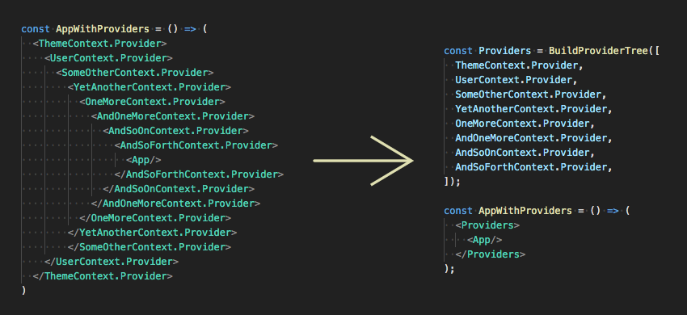

---

### React useReducer

Please read about:

- [Finite-state machine](https://en.wikipedia.org/wiki/Finite-state_machine)
- [State pattern](https://en.wikipedia.org/wiki/State_pattern)
- [State pattern JS](https://github.com/Bigismall/ecmascript-design-patterns/blob/master/stan.md)
- [React Robot](https://thisrobot.life/integrations/react-robot.html)

---

```ts
export const MessageTemplateReducerInit = (): MessageTemplatesState => ({
  list: true,
  listTypeEdit: false,
  form: false,
})

const [templatesState, templatesDispatch] = React.useReducer(MessageTemplatesReducer, {}, MessageTemplateReducerInit)
```

---

```ts
export const MessageTemplatesReducer = (state: MessageTemplatesState, action: MessageTemplatesAction): MessageTemplatesState => {
  switch (action.type) {
    case MessageTemplatesActionType.RESET:
      return MessageTemplateReducerInit()
    case MessageTemplatesActionType.MESSAGES_LIST:
      return {
        list: true,
        listTypeEdit: false,
        form: false,
      }
    case MessageTemplatesActionType.MESSAGES_LIST_EDIT:
      return {
        list: true,
        listTypeEdit: true,
        form: false,
      }
    case MessageTemplatesActionType.MESSAGE_ADD:
      return {
        list: false,
        listTypeEdit: false,
        form: true,
        answerTemplate: undefined,
      }
    case MessageTemplatesActionType.MESSAGE_EDIT:
      return {
        list: false,
        listTypeEdit: true,
        form: true,
        answerTemplate: action.payload.answerTemplate,
      }
    case MessageTemplatesActionType.MESSAGE_DELETE:
      return {
        list: true,
        listTypeEdit: true,
        form: false,
      }
  }
}

```
---

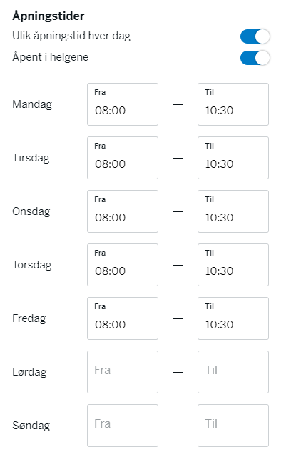

---

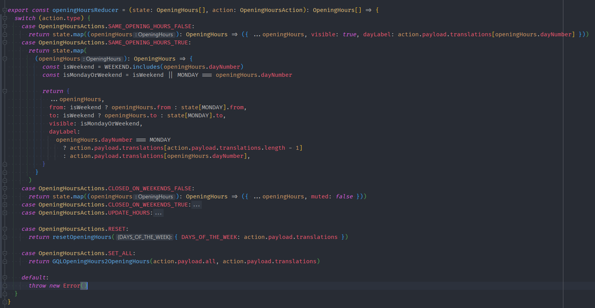

---

## React useLayoutEffect


 - `useLayoutEffect` - before commit phase
 - `useLayoutEffect` - after commit phase


The signature is identical to `useEffect`, but it fires synchronously after all DOM mutations. Use this to read layout from the DOM and synchronously re-render. Updates scheduled inside useLayoutEffect will be flushed synchronously, before the browser has a chance to paint.

Prefer the standard useEffect when possible to avoid blocking visual updates.

---

#React useMemo

```ts
const memoizedValue = useMemo(() => computeExpensiveValue(a, b), [a, b]);
```
---

```ts
  const showInsufficientFundsAlert = React.useMemo(
    () => data && !data.job.isAnswered && !data.job.isDeleted && data.job.answerAccess.code === GQLAnswerAccessCode.DENIED_INSUFFICIENT_FUNDS,
    [data]
  )
  const showCompanyLacksSubscriptionAlert = React.useMemo(
    () => data && !data.job.isAnswered && !data.job.isDeleted && data.job.answerAccess.code === GQLAnswerAccessCode.DENIED_COMPANY_LACKS_SUBSCRIPTION,
    [data]
  )

  const allowComposeMessage = React.useMemo(() => data && !data.job.isAnswered && !data.job.isDeleted && data.job.answerAccess.isOpen && !answerJobData, [
    data,
    answerJobData,
  ])
```

---

#React useCallback

```js
const memoizedCallback = useCallback(
  () => {
    doSomething(a, b);
  },
  [a, b],
);
```
---
```ts

  // initialize the api instance
  const initState = React.useCallback(async () => {
    const flagsClientInstance = new FeatureFlagsClient({ ...defaultConfig, ...config })
    const initFF = await flagsClientInstance.init()

    if (initFF) {
      await setStore(flagsClientInstance.config.userId, flagsClientInstance.getFlags())
    } else {
      const localStorageFlags = await getStore(flagsClientInstance.config.userId)
      dev.log('LOADING FEATURE FLAGS from Local storage')
      flagsClientInstance.setFlags(Object.entries(localStorageFlags?.data ?? []).map(([, v]): FeatureFlagObject => v as FeatureFlagObject))
    }

    setFlagsClient(flagsClientInstance)
  }, [defaultConfig, config])

  // call the init on load
  React.useEffect(() => {
    initState()
  }, [initState])

```

---

- useDebugValue
- useRef

---

## Awesome React Hooks

https://github.com/rehooks/awesome-react-hooks

```js

function useDocumentTitle(title, retainOnUnmount = false) {
  const defaultTitle = useRef(document.title);

  useEffect(() => {
    document.title = title;
  }, [title]);

  useEffect(() => {
    return () => {
      if (!retainOnUnmount) {
        document.title = defaultTitle.current;
      }
    };
  }, []);
}
```
