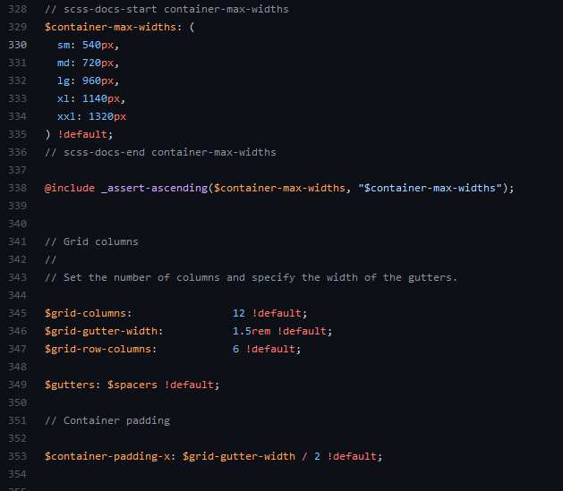
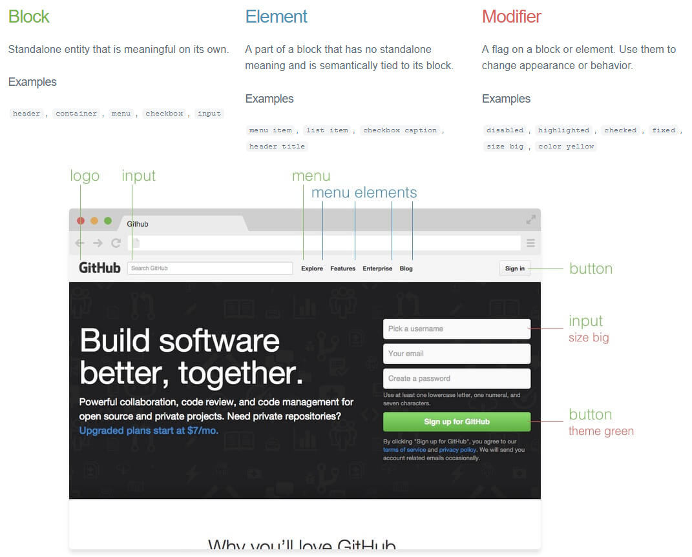
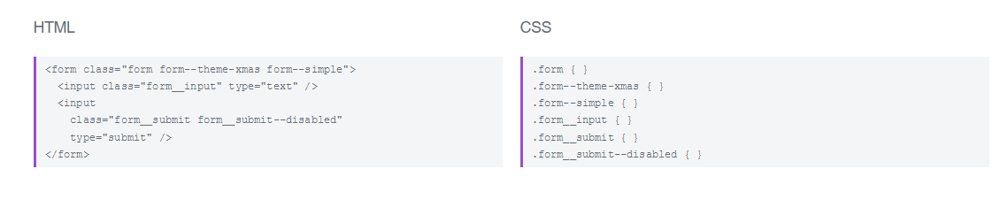
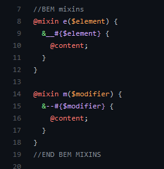
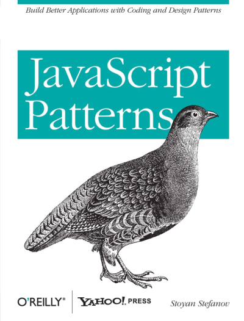

# Expectaions

- General improvement in my front end skills, bootstraps available classes seems to be a gap in my knowledge
- JavaScript in general.


- Learn more about pros/cons with React vs. Angular/Vue/other. Learn more about React in general.
- Just general things surrounding React to get tips and pointers from the more experienced staff. I would also like to hear more about what other frameworks
  might potentially be used for future projects.


- React
- Good/clean code practice, functional code, SEO, reducing, context, hooks
- more about hooks

---

## CSS

---

### CSS Frameworks (https://github.com/troxler/awesome-css-frameworks)

- Bootstrap
- Foundation
- TailWind
- Semantic UI, Bulma
- Water.css

---

#### Bootstrap

Bootstrap makes only sense, when we're working with the sources. (https://github.com/twbs/bootstrap/blob/main/scss/_variables.scss)



---

#### Tailwind

Known as very useful when working with components.

---


---

As you can see, the biggest issue is that the **VIEW** layer is mixed with the **PRESENTATION** layer.   
This mean, that if we want to change the appearance (styles,colors etc) we have to change the view. What if we want to change the main (brand) color in our
design? We have to change the whole application views!

---


---

#### Water.css

No class CSS - mean no conflicts and nothing to learn. Just use pure HTML and water will do the rest!
Excellent idea for bootstrapping projects/docs.

See (https://watercss.kognise.dev/)

---

### Naming conventions

Read more (https://dev.to/ziizium/css-naming-conventions-5gd6)

- BEM
- SMACSS
- ITCSS
- OOCSS ()
- AMCSS
- Storytelling CSS Class Names

---

#### BEM

Block Element Modifier (http://getbem.com/)
---



---

In CSS


HTML vs CSS



---
You don't need to write such long CSS classes by hand. Use SASS mixins for that (https://gist.github.com/Bigismall/8472451f82d77dd380447bea555be163)



Do not apply HTML structures into BEM structure!

---

### SCSS

Please use SCSS

- https://www.sassmeister.com/
- IDE (scss watchers)
- http://koala-app.com/

---

### CSS custom properties (a.k.a variables)

See presentation: (https://docs.google.com/presentation/d/1XffJxDlG5XSxT8MnXfQKUuf0xQ-MAxF9Bclvy6Fa3R8/edit?usp=sharing)

---

### New features in CSS ?

- css variables
- css scroll-behavior
- css scroll-snap
- css grid / css subgrid
- css grid masonry layout
- css Flexbox gaps
- css display: contents
- css object-fit: cover;
- css paint api
- css `content-visibility` https://developer.mozilla.org/en-US/docs/Web/CSS/content-visibility
- css `aspect-ratio` https://developer.mozilla.org/en-US/docs/Web/CSS/aspect-ratio

---

## JavaScript

---


---

### Books

[Github Repository](https://github.com/chocopuff2020/javascript-ebooks-1)

---

[Good parts](https://github.com/chocopuff2020/javascript-ebooks-1/blob/master/%5BJavaScript%20The%20Good%20Parts%201st%20Edition%20by%20Douglas%20Crockford%20-%202008%5D.pdf)


---


---

[JavaScript Patterns](http://sd.blackball.lv/library/JavaScript_Patterns_%282010%29.pdf)



----


---

### My Book 

JavaScript basics: (https://github.com/Bigismall/js-basic)

---


#### Timeout zero

Skoro wiemy już, że możemy symulować asynchroniczność, to chcielibyśmy realizować to natychmiast, pomijając jakiekolwiek opóźnienie. Ustawiamy zatem 0ms, w nadziei, że przekazana funkcja uruchomi się  "od razu".  Nawet jednak ustawienie 0ms nie zmienia sposobu działania JavaScript.  Nie jest bowiem tak, że JS porzuci wszystkie inne zadania i zajmie się  naszym. Obowiązują reguły ustawiania się w kolejce.  Nie uruchomi tez naszego zadania w osobnym wątku, bo nie potrafi.

---

#### Timeout zero - example

```js
(function () {

    console.log('this is the start');

    setTimeout(function callBackOne() {
        console.log('this is a msg from call back one');
    });

    console.log('this is just a message');

    setTimeout(function callBackTwo() {
        console.log('this is a msg from call back two');
    }, 0);

    console.log('this is the end');
})();
```

[https://codepen.io/Bigismall/pen/LLZGax](https://codepen.io/Bigismall/pen/LLZGax)

---

#### Timeout zero - result

```
this is the start
this is just a message
this is the end
this is a msg from call back one
this is a msg from call back two
```

Jak widać mimo iż  `callBackOne()`  i `callBackTwo()` zostały wywołane z parametrem 0ms \(lub jego brakiem\), ich wykonanie zostało odłożone na koniec kolejki \(przy czym zachowana została kolejność, wynikająca z 0ms\)

Intuicyjnie zatem wykonie `setTimeOut(function,0)`  mówi - wykonaj tą funkcję tak szybko jak będzie to tylko możliwe.


---

### JavaScript gotchas!

---

#### TimeOut Sort


```js
var numbers = [38, 43, 33, 43, 27, 20, 33, 17, 49, 11, 30, 27, 35, 42, 14, 32, 44, 44, 16, 44];

numbers.forEach(function (number) {
    (function (number) {
        setTimeout(function () {
            console.log(number)
        }, number);
    }(number));
});
```

[https://codepen.io/Bigismall/pen/QgEyoY](https://codepen.io/Bigismall/pen/QgEyoY)

---

#### Automatic type conversion

```js
console.log([1,5,20,10].sort()) //[ 1, 10, 20, 5 ]
```

[https://codepen.io/Bigismall/pen/gRMPye](https://codepen.io/Bigismall/pen/gRMPye)

---

#### Are the numbers equal?

```js
var a = 0.1,
    b = 0.2,
    c = 0.3;

console.log((a + b) === c);    //false
```

```js
var a = 0 * 1,
    b = 0 * -1;

console.log(a, b);      //0 -0
console.log(a === b);   //true
console.log(1/a === 1/b);   //false
```

[https://codepen.io/Bigismall/pen/XgKXwb](https://codepen.io/Bigismall/pen/XgKXwb)

---

#### To string evaluation

```js
var a = 1,
    b = "2",
    c = a + b,
    d = b + a,
    e = (b + b) * 1,
    f = a + a;

console.log(c, typeof c);   // 12 string
console.log(d, typeof d);   // 21 string
console.log(e, typeof e);   // 22 number
console.log(f, typeof f);   // 2 number
```

[https://codepen.io/Bigismall/pen/OgXMYE](https://codepen.io/Bigismall/pen/OgXMYE)

---

#### Type of  trap

```js
typeof {} === "object" //true
typeof "" === "string" //true
typeof [] === "array"; //false
```

[https://codepen.io/Bigismall/pen/gRMPNz](https://codepen.io/Bigismall/pen/gRMPNz)

---

#### Math min and max values

```js
console.log(Math.max()); // -Infinity
console.log(Math.min()); // Infinity
```

[https://codepen.io/Bigismall/pen/dRXGxR](https://codepen.io/Bigismall/pen/dRXGxR)

---

### JS Interview questions

- https://dev.to/macmacky/70-javascript-interview-questions-5gfi
- https://skilled.dev/course/javascript-interview-questions

---

### JS killer question


